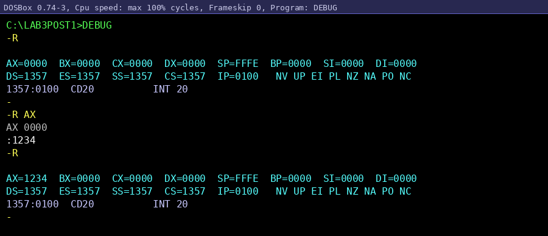
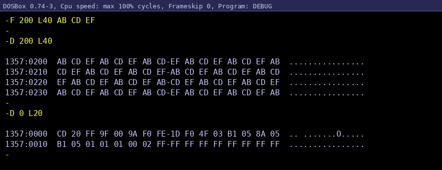
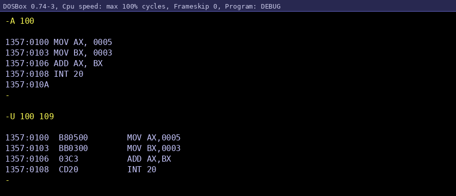

[README.md](https://github.com/user-attachments/files/26530933/README.md)
# Laboratorio: Exploración con DEBUG en DOSBox

**Repositorio:** apellido-post1-u3  
**Unidad:** 3  
**Plataforma:** DOSBox 0.74 sobre Windows 

---

## Descripción del Laboratorio

Este laboratorio tiene como objetivo explorar el funcionamiento interno del procesador x86 en modo real utilizando el programa **DEBUG** de MS-DOS ejecutado dentro del emulador **DOSBox**. A través de una serie de pasos guiados, se inspeccionan y modifican registros del procesador, se manipula directamente la memoria RAM mediante volcados hexadecimales, y se ensambla y desensambla un programa de instrucciones x86 básicas.

El laboratorio está dividido en cuatro partes:
- **Parte A:** Configuración del entorno DOSBox.
- **Parte B:** Inspección y modificación de registros con el comando `R`.
- **Parte C:** Volcado de memoria con `D` y relleno con `F`.
- **Parte D:** Desensamblado con `U` y ensamblado con `A`.

---

## Parte A — Configuración del Entorno DOSBox

### Paso 1: Montar la carpeta de trabajo

Al abrir DOSBox el prompt inicial es `Z:\>`. Se monta la carpeta del sistema anfitrión como unidad `C:` virtual:

```
Z:\> MOUNT C C:\DOSWork
Drive C is mounted as local directory C:\DOSWork\
Z:\> C:
C:\>
```

### Paso 2: Crear la subcarpeta del laboratorio

```
C:\> MD LAB3POST1
C:\> CD LAB3POST1
C:\LAB3POST1>
```

### Paso 3: Iniciar DEBUG

```
C:\LAB3POST1> DEBUG
-
```

---

## Parte B — Inspección de Registros con el Comando R

### Comandos utilizados

| Comando | Descripción |
|--------|-------------|
| `R` | Muestra el estado completo de todos los registros del procesador |
| `R AX` | Permite modificar el registro AX de forma selectiva |

### Paso 4: Estado inicial de los registros

```
-R
AX=0000  BX=0000  CX=0000  DX=0000  SP=FFFE  BP=0000  SI=0000  DI=0000
DS=1357  ES=1357  SS=1357  CS=1357  IP=0100   NV UP EI PL NZ NA PO NC
1357:0100  CD20          INT 20
```

### Paso 5: Modificar el registro AX

```
-R AX
AX 0000
:1234
-R
AX=1234  BX=0000  CX=0000  ...
```

### Observaciones — Checkpoint 1

- Los registros de propósito general `AX`, `BX`, `CX`, `DX` inician en `0x0000`.
- `SP=FFFE` indica que la pila está al tope del segmento (64 KB − 2 bytes).
- Los cuatro registros de segmento (`DS`, `ES`, `SS`, `CS`) apuntan al mismo párrafo `0x1357`, que corresponde al **PSP** (Program Segment Prefix) asignado por el DOS.
- `IP=0100` es la primera dirección ejecutable tras el PSP (los primeros 256 bytes son del PSP).
- La instrucción `INT 20` en `1357:0100` es el punto de terminación de programa colocado por DOS.
- La modificación de `AX` a `0x1234` (4660 decimal) es **selectiva**: ningún otro registro cambia.

---

## Parte C — Volcado de Memoria con D y Relleno con F

### Comandos utilizados

| Comando | Descripción |
|--------|-------------|
| `F 200 L40 AB CD EF` | Rellena 64 bytes (0x40) desde DS:0200 con el patrón ciclico AB CD EF |
| `D 200 L40` | Vuelca en hexadecimal los 64 bytes desde DS:0200 |
| `D 0 L20` | Vuelca los primeros 32 bytes del segmento (zona del PSP) |

### Paso 6: Relleno con F

```
-F 200 L40 AB CD EF
-
```

El DEBUG no emite mensaje de confirmación; el prompt `-` indica éxito. El patrón `AB CD EF` se repite cíclicamente hasta completar los 64 bytes.

### Paso 7: Volcado con D

```
-D 200 L40
1357:0200  AB CD EF AB CD EF AB CD-EF AB CD EF AB CD EF AB  ................
1357:0210  CD EF AB CD EF AB CD EF-AB CD EF AB CD EF AB CD  ................
1357:0220  EF AB CD EF AB CD EF AB-CD EF AB CD EF AB CD EF  ................
1357:0230  AB CD EF AB CD EF AB CD-EF AB CD EF AB CD EF AB  ................
```

### Paso 8: Exploración del PSP

```
-D 0 L20
1357:0000  CD 20 FF 9F 00 9A F0 FE-1D F0 4F 03 B1 05 8A 05  .. .......O.....
1357:0010  B1 05 01 01 01 00 02 FF-FF FF FF FF FF FF FF FF  ................
```

### Observaciones — Checkpoint 2

**Columnas del comando `D`:**

La salida del comando `D` tiene tres columnas bien diferenciadas. La primera columna muestra la **dirección de segmento:desplazamiento** (ej. `1357:0200`) que indica la posición exacta en memoria de donde comienzan los bytes de esa fila. La segunda columna es el **volcado hexadecimal** de los bytes, agrupados en dos grupos de 8 separados por un guion, lo que facilita contar los 16 bytes por fila. La tercera columna es la **representación ASCII** de esos mismos bytes: si el valor está en el rango imprimible (0x20–0x7E) se muestra el carácter, de lo contrario se muestra un punto (`.`). En este caso todo el bloque muestra puntos porque `0xAB`, `0xCD` y `0xEF` son valores no imprimibles en ASCII estándar.

Los primeros dos bytes del PSP (`CD 20`) corresponden a la instrucción `INT 20`, que DOS coloca allí como mecanismo de terminación de emergencia para programas `.COM`.

---

## Parte D — Desensamblado con U y Ensamblado con A

### Comandos utilizados

| Comando | Descripción |
|--------|-------------|
| `U 100 L10` | Desensambla 16 bytes desde CS:0100 |
| `A 100` | Permite ingresar instrucciones ensamblador desde CS:0100 |
| `U 100 109` | Verifica el ensamblado mostrando los bytes de código máquina |

### Paso 9: Desensamblado inicial

```
-U 100 L10
1357:0100  CD20          INT 20
1357:0102  0000          ADD [BX+SI],AL
1357:0104  0000          ADD [BX+SI],AL
...
```

Los bytes `0x00 0x00` se interpretan como `ADD [BX+SI],AL`, la codificación de dos bytes cero en x86. Esto muestra que en modo real no existe distinción entre código y datos.

### Paso 10: Ensamblado con A y verificación con U

```
-A 100
1357:0100 MOV AX, 0005
1357:0103 MOV BX, 0003
1357:0106 ADD AX, BX
1357:0108 INT 20
1357:010A
-

-U 100 109
1357:0100  B80500        MOV AX,0005
1357:0103  BB0300        MOV BX,0003
1357:0106  03C3          ADD AX,BX
1357:0108  CD20          INT 20
```

### Observaciones — Checkpoint 3

- `MOV AX,0005` se codifica como `B8 05 00` (opcode `B8` + inmediato `0x0005` en **little-endian**).
- `MOV BX,0003` se codifica como `BB 03 00`.
- `ADD AX,BX` se codifica como `03 C3` (opcode `03` + ModRM `C3`).
- `INT 20` se codifica como `CD 20`.
- El programa completo ocupa exactamente **10 bytes** (0x0100 a 0x0109).
- El programa suma 5 + 3 = 8 y termina con `INT 20`.

---

## Estructura del Repositorio

```
Torres-Post1-U3/
├── README.md
└── capturas/
    ├── CP1_registros.png
    ├── CP2_volcado_memoria.png
    └── CP3_ensamblado_desensamblado.png
```

---

## Checkpoints

### Checkpoint 1 — Estado de Registros


**Verificación:** AX, BX, CX, DX visibles con valores correctos; registros de segmento con el mismo valor `1357`; `IP=0100`.

---

### Checkpoint 2 — Volcado Hexadecimal


**Verificación:** El patrón `AB CD EF` es visible y se repite en las 4 filas del volcado.

---

### Checkpoint 3 — Ensamblado y Desensamblado


**Verificación:** Las 4 instrucciones (`MOV AX`, `MOV BX`, `ADD`, `INT 20`) son visibles con sus bytes de código máquina correctos.

---

## Conclusiones

1. **DEBUG** es una herramienta poderosa que permite inspeccionar y modificar directamente el estado del procesador y la memoria en tiempo real bajo MS-DOS.
2. En el **modo real x86**, no existe separación entre código y datos: cualquier byte en memoria puede ser interpretado como una instrucción si el `CS:IP` apunta a él.
3. El **PSP** (Program Segment Prefix) es una estructura de 256 bytes que DOS prepara antes de ejecutar cualquier programa, e incluye la instrucción `INT 20` en su inicio como mecanismo de terminación segura.
4. Las instrucciones x86 usan **little-endian**: los bytes de menor peso se almacenan primero en memoria.
5. El comando `F` permite inicializar regiones de memoria con patrones conocidos, lo que facilita la verificación visual con `D`.
